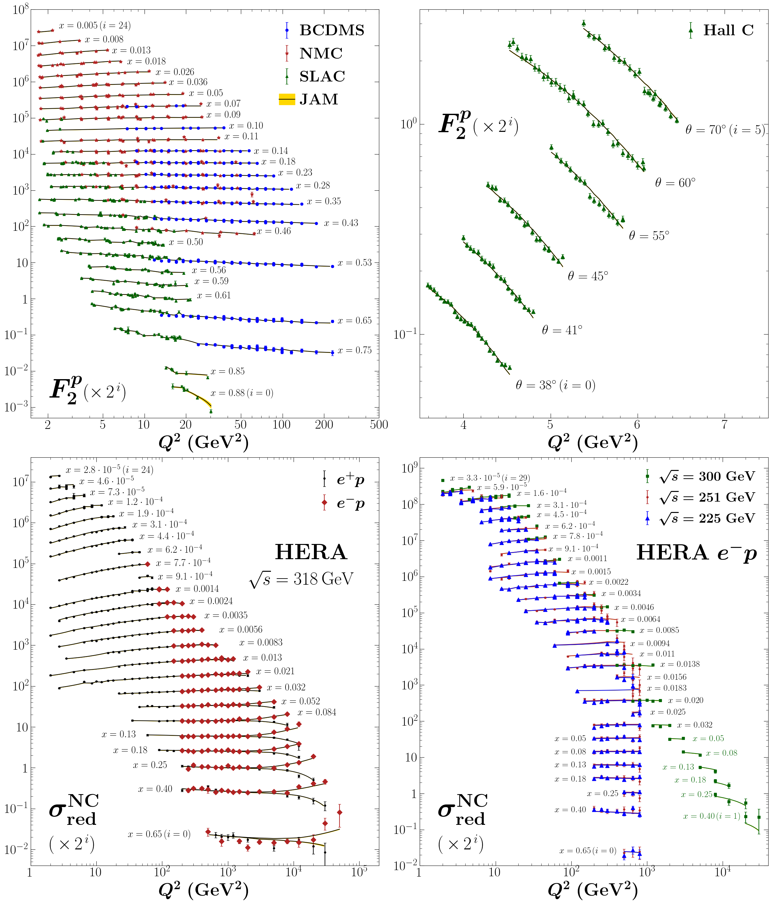
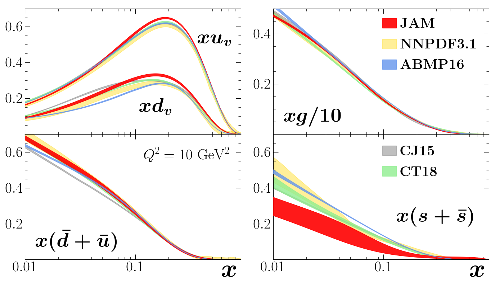
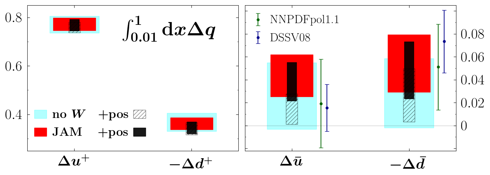

# Code Examples (in progress)

**Diffpack**

This code example is the basis of many of my projects.
It is used to extract functions that describe the internal structure of protons and neutrons.
We model this internal structure, calculate its relation to experimental measurements, and perform a $\chi^2$ minimization to match our model to the experimental data.

It consists of the following modules:
* <u>database</u>: Experimental data is stored here
* <u>fitlib</u>: This module contains the central code that performs the $\chi^2$ minimization
* <u>qcdlib</u>: This module is where the functions are modeled
* <u>obslib</u>: This module relates the functions to the experimental measurements
* <u>tools</u>: This module contains tools used elsewhere, including parallelization and reading Excel files

**analysis**

This directory contains the code used to submit the $\chi^2$ minimizations and analyze them afterwards.  It contains the following folders:
* <u>inputs</u>: Contains input files that specify the theory, model, experimental, and parameterization inputs for each $\chi^2$ minimization
* <u>results</u>:  Where the results are stored after the $\chi^2$ minimization
* <u>analysis</u>: Contains code that allows one to analyze the resulting fit to experimental data as well as the extracted functions
* <u>plots</u>:  Contains code used to visualize data and create figures ready for publication

Here are some example plots made in this directory:

